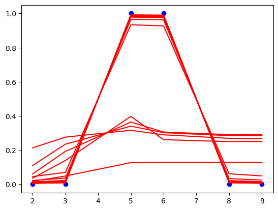

# hidden-layer-training-visualization
하나의 은닉층을 가진 간단한 신경망이 이진 분류 문제에 대해 학습됨. Matplotlib을 사용하여 학습 과정을 시각화하여 네트워크가 시간이 지남에 따라 어떻게 학습하는지 관찰함.

# 🧠 Hidden Layer Machine (Neural Network Training Visualization)

## 📌 프로젝트 개요
이 프로젝트는 **신경망의 은닉층(hidden layer) 학습 과정**을 시각적으로 확인할 수 있는 실험적인 구현입니다.

이 신경망은 1개의 은닉층(hidden layer)을 가지며, 활성화 함수로 시그모이드(sigmoid)를 사용합니다.
주어진 입력 데이터 `(x, t)`를 학습하며, 각 학습 단계마다 손실 함수 값을 출력하고 시각적으로 학습 진행 과정을 확인할 수 있습니다.

---

## 🕒 개발 히스토리
- 📌 **최초 작성:** 2023년 12월 12일  
- 📌 **업데이트:** 2025년 3월 (GitHub에 코드 공유 및 문서화 추가)  
- 📌 **Google Colab에서 작성 후, GitHub로 관리하도록 변경**  
- 📌 **학습 과정 시각화를 위해 Matplotlib 그래프 활용**  

---

## 📂 프로젝트 폴더 구조
```
📄 이미지_1.png             # 학습 과정 그래프
📄 hiddenlayer_machine.ipynb   # 주요 코드 및 실행 파일 (Google Colab 환경에서 실행 가능)
📄 README.md               # 프로젝트 설명 파일
```

---

## ⚙️ 코드 설명
### 1️⃣ 데이터셋
- 입력 데이터 `x = [2, 3, 5, 6, 8, 9]`
- 목표 값 `t = [0, 0, 1, 1, 0, 0]`

이 데이터는 **이진 분류 문제**를 학습하기 위한 간단한 샘플 데이터입니다. 5, 6 근처는 1을 출력하고, 나머지는 0을 출력하는 문제입니다.

---

## 🔧 신경망 구조 및 학습 과정
1. **입력층 → 은닉층(2개 뉴런) → 출력층(1개 뉴런)** 구성
2. **시그모이드(sigmoid) 함수**를 사용하여 활성화
3. **손실 함수:** 평균 제곱 오차(MSE) 사용
4. **학습률(eta):** 2.5로 설정
5. **최대 학습 반복 횟수:** 10,000번
6. **수렴 조건:** 손실값의 변화(residual)가 `1.0e-15` 이하일 때 중지

학습이 진행됨에 따라 신경망의 가중치가 조정되며, 그래프를 통해 학습된 결과를 시각적으로 확인할 수 있습니다.

---

## 📊 학습 결과 시각화
Matplotlib을 활용하여 학습 과정 중 예측값이 점점 목표값 `t`에 가까워지는 과정을 시각적으로 확인할 수 있습니다.

- 빨간색 선: 학습된 모델의 예측값
- 파란색 점: 실제 목표값 `t`
- 이미지 첨부: 아래는 학습 과정에서 출력된 예측값의 변화를 시각적으로 보여주는 그래프입니다.



매 학습 단계(예: 10회, 50회, 100회, ..., 10,000회)마다 예측값이 점진적으로 조정되는 모습을 그래프에서 확인할 수 있습니다.

---

## 🏃 실행 방법
### 📌 Google Colab에서 실행
1. `hiddenlayer_machine.ipynb` 파일을 Colab에서 열기
2. 셀을 순차적으로 실행하여 학습 과정 확인
3. 최종적으로 학습된 모델의 예측 결과를 확인

### 📌 로컬 환경에서 실행 (Jupyter Notebook)
```bash
jupyter notebook hiddenlayer_machine.ipynb
```
---

## 🚀 마무리
이 프로젝트는 신경망의 기본적인 학습 과정을 이해하고, 학습이 진행됨에 따라 가중치가 조정되는 과정을 직관적으로 파악하는 데 목적이 있습니다.

📌 향후 개선 사항:
- 다양한 활성화 함수 (ReLU, Tanh 등) 실험
- 은닉층 개수를 늘려 성능 비교
- 손실 함수 변경 및 비교 (Cross-Entropy 등)
- 학습률(eta) 변화에 따른 수렴 속도 비교
 
신경망 학습 과정을 실험적으로 분석하는 데 유용합니다.
